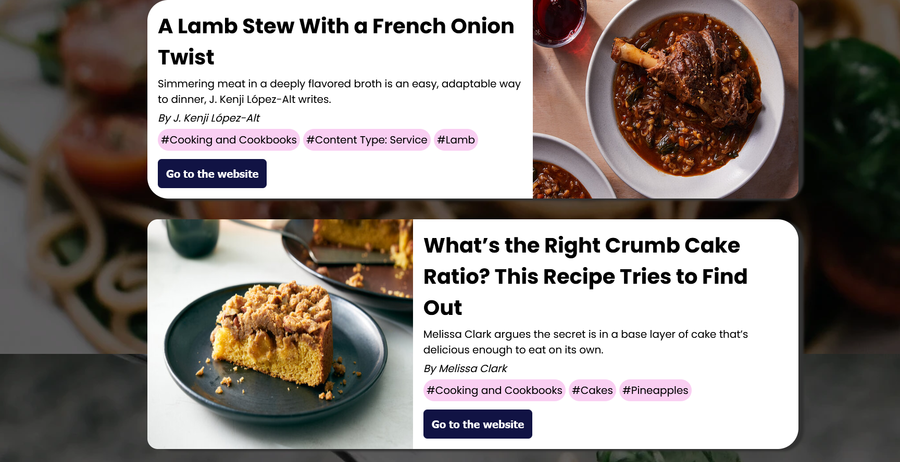
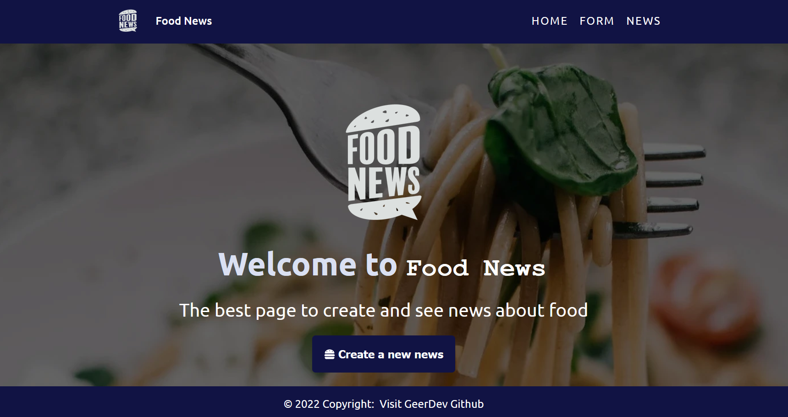
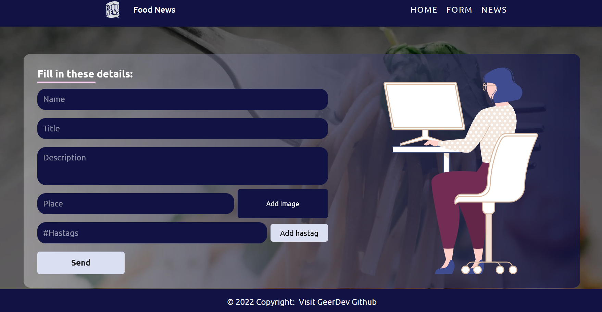
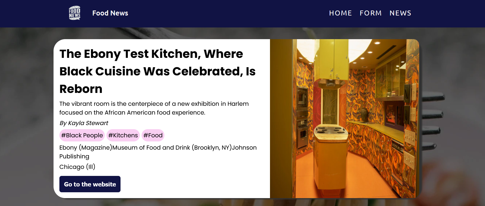
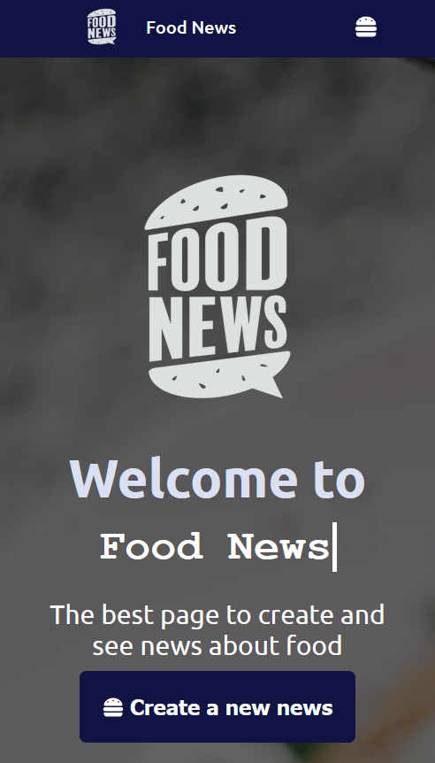
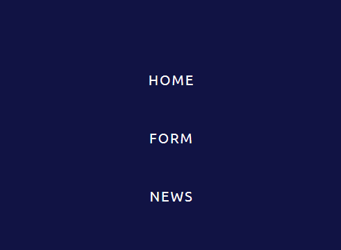

# Aplicación de noticias sobre comida

_Una aplicación hecha con React donde se muestran noticias relacionadas con comida_

 

## Un proyecto hecho con React 🚀

En el proyecto utilizamos distintas funcionalidades que nos proporciona React:

* Descomposición en componentes de React
* React Routing
* Uso de hooks, como useState, useEffect, useReducer, useContext
* Manejo de formularios en React
* Gestión del ciclo de vida de los componentes en React
* Uso de Context para hacer la llamada a la API de noticias
* Uso de Sass dentro de React
  
## ¿Como desplegar el proyecto? 📋

Estas instrucciones te permitirán obtener una copia del proyecto en funcionamiento en tu máquina local para propósitos de desarrollo:

Clonarte el repositorio localmente:
> git clone url del repositorio

Instalar las depedencias necesarias:
> npm i

Ejecutar el script para iniciar el proyecto:

> npm start

😊 Genial ya tenemos todo listo para ver nuestra aplicación en desarrollo 😊

## Interfaces y funcionalidades de la aplicación
- Pantalla Home donde se muestra una portada con el logo y una descripción de nuestra aplicación. Además tiene un boton para navegar a la parte del formulario de nuestra aplicación.

 

- Pantalla Form, muestra un formulario para rellenar una noticia y poder insertala en la lista de noticias, actualmente la noticia la guardamos en LocalStorage.

 

- Pantalla News, muestra la lista con todas las noticias sobre comida que tenemos disponible a día de hoy.

 

Todo el diseño es responsive y además disponemos de un menú hamburguesa en la vista para móvil donde disponemos de los botones de navegación.
    

        
          
    

## 📌 Organización a la hora de trabajar en este proyecto 📌

El proyecto consta de dos ramas: main y develop, las distintas funcionalidades del proyecto se han implementado en distintas ramas que posteriormente se han fusionado con la rama develop que es la encargada de actualizar todo el trabajo de desarrollo. Finalmente cuando tengamos versiones estables de la rama develop la fusionamos con la rama main, la encargada de mostrar nuestro Back-End en producción.

---
Hecho por [Germán Fernández](https://github.com/GeerDev) 😊 

